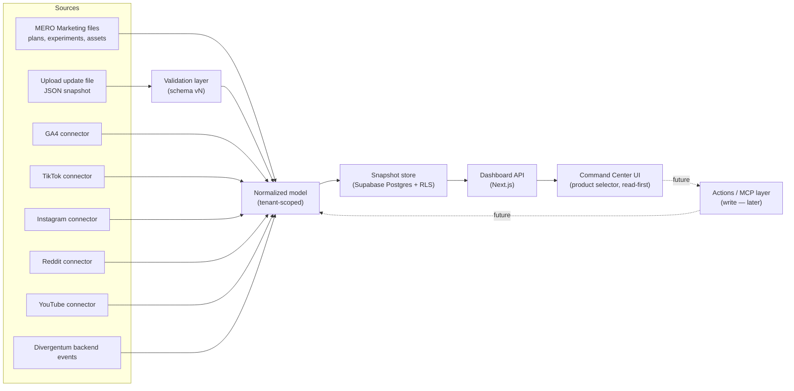

# MERO Marketing Command Center — online architecture

> **Status:** v2 (2026-06-29). Supersedes the v1 "online static" draft. Locks the stack, the
> multi-product/multi-tenant model, and adds the actions/MCP layer. This is the shared plan for
> **Codex** (data/content model, marketing) and **Claude Code** (app + backend in the Studio).

## Purpose

MERO Marketing Command Center is the online control room for marketing across Merowingus Studio
products. First product is **Divergentum**; the system is built to be reusable for every next product
**and** to grow into a multi-tenant SaaS for other founders.

It shows: current focus · active channels · published assets · running experiments · planned work ·
manual + automated metrics · next actions · parked work.

The long-term goal is not a report. It is an **operating system for marketing decisions** — read
first, then act. "Command center" = it will eventually **run** marketing (publish, trigger agents,
record results), not only display it. That control layer is built gradually; see [Actions / MCP
layer](#7-actions--mcp-layer-grows-over-time).

## Locked decisions (2026-06-29)

These were open questions in v1. They are now decided and drive the rest of the document.

1. **Future SaaS → multi-tenant.** Every stored row carries a `tenant_id` from day one, even though
   there is exactly one tenant (Mykola) today. Tenant isolation is enforced at the database layer
   (Row-Level Security), not in app code.
2. **Multi-product from day one.** The UI has a product selector; Divergentum is the default. One
   tenant owns many products. `tenant → products → campaigns → channels → assets/experiments/metrics`.
3. **Read-first command center.** Phase 1–3 are about *seeing* state on a real backend. The
   actions/MCP layer (write, run agents from the web) comes later, in deliberate small steps.
4. **Stack is decided** (see next section). There is no "static online" phase — Phase 1 already needs
   a small backend, so we name it honestly.
5. **One design system, shared by reference.** The app imports Studio design tokens; it must not
   re-define them. (v1's local dashboard duplicated tokens — that drift stops here.)

## Stack

| Concern | Choice | Why |
|---|---|---|
| App framework | **Next.js (TypeScript)** | public + authed routes in one app; API routes for upload/connectors; same language as the Anthropic Agent SDK for the later MCP layer. |
| Hosting / deploy | **Vercel** | zero-ops deploys, cron, serverless functions, one domain → many surfaces. |
| Database | **Supabase Postgres** | relational model the data already implies; **Row-Level Security** is purpose-built for multi-tenant SaaS. |
| Auth | **Supabase Auth** | Mykola-only now, open registration later, no rewrite. |
| Secrets (connector tokens) | **Supabase Vault / server-side env** | GA4 / social tokens stored encrypted, server-side only, never in frontend JS. |
| Scheduling | **Supabase cron (pg_cron) / Vercel cron** | periodic connector runs. |
| Design system | **Shared tokens package** (from `Studio/website/Design/tokens`) | one source of truth for look across marketing site + app. |

Cost: starts on free tiers ($0). Pro tiers (~$20–25/mo each) only when usage demands. Works on Windows.

**Alternative on record:** Cloudflare (Pages + Workers + D1 + Access) — cheaper at scale, more
control, but Auth + multi-tenant must be assembled by hand. Revisit only if Supabase limits/cost bite.

## Site shape — one domain, two surfaces

"One website, one design system" = **one domain + shared design tokens**, not one HTML file.

- **Marketing site** — `merowingus.com` (home, products, tools, blog). Public, SEO-important, mostly
  static. **Not rewritten** by this project; it keeps its current static form.
- **Command Center (this project)** — the SaaS app, behind auth, at **`app.merowingus.com`** (or
  `merowingus.com/tools/marketing` — a routing detail). Dynamic, Next.js + Supabase.

Both consume the same shared design tokens, so they look like one product.

### Repo & deploy strategy

The end state is a **monorepo** (`apps/marketing`, `apps/command-center`, `packages/design-system`,
`packages/schema`) deployed by Vercel. **Not built today.** For now:

- The local prototype keeps living in `C:\CODE\MERO MARKETING\dashboard\` (static, throwaway-friendly).
- Its `dashboard/data.js` is treated as the **fixture / shape of the future Postgres tables**, not
  production code.
- Integration between product work and the Studio site happens via **automation (shared token
  package + CI/submodule), never manual copy-paste.** Manual porting is the drift we are avoiding.

## Fit within the Studio platform

> **The base for connecting other Studio products is the shared platform layer — not the internals of
> any one tool.** The pattern generalizes; the schema does not.

Per the Studio structure source of truth (`MEROWINGUS Studio/strategy/agentic-engine.md`): MERO tools
(Marketing, SEO, Job Hunt, Product) are **parallel siblings** — separate repos, separate users,
independent Lean hypotheses. They are **not** fused into one monolith. **MERO Product (the Planner) is
the orchestrator / front door** that calls each tool.

So the command center is **the first tool to stand on the shared stack**, not the platform hub. What
becomes reusable for the next product is the **shared layer**, built once and consumed by all:

| Shared platform layer (the base) | Status here |
|---|---|
| **Design tokens / UI** (from `Studio/website/Design/tokens`) | imported by reference, never re-declared |
| **Auth + tenant + RLS** (Supabase) | one tenant model + RLS, reusable by every tool |
| **Agentic engine** (Vercel serverless → loads a SKILL → Claude API → structured JSON) | the canon engine; this app runs on it |
| **Contract + MCP convention** (normalized ingest + provenance, exposed via an MCP server) | `snapshot.v1` is the **first instance** of the pattern |

What stays **tool-specific** (never centralized into a "god schema"):

- The marketing domain model (campaigns, channels, metrics, experiments) and `snapshot.v1` itself.
- Job Hunt (jobs/resumes/interviews) and SEO (keywords/rankings/briefs) define their **own** domain
  schemas. They copy the **shape/pattern** of `snapshot.v1`, not the schema.

**Build rule (don't over-abstract early):** build marketing concretely on the shared stack now, but
keep the seams clean — tokens from the shared package, engine + auth so a second tool can take them,
and `snapshot.v1` written as *the example other tools will copy*. Extract the platform packages
(`packages/design-system`, `packages/engine`, `packages/auth`) only when the **second** tool arrives
(rule of three) — so the abstraction is discovered, not guessed.

**Orchestration:** cross-product work is driven from the Planner (MERO Product); each tool exposes its
model via MCP so the Planner — and Claude — can read state and (gated) act across tools.

## Product principle

**One model, many data sources.** The UI never cares whether a metric came from a hand-uploaded file,
GA4, TikTok, Instagram, Reddit, YouTube, or a future product event stream. Every source is normalized
into the same internal shape, and every metric carries its provenance.

## Architecture overview



## Application layers

### 1. UI layer (read-first)

- Product selector (default Divergentum); active product from `?product=<id>`, fallback `localStorage`.
- Renders campaign state, channel cards, data-viz cards, KPIs, experiments, next actions, parked work.
- Shows latest snapshot timestamp, upload status, validation results.
- **Reusability rule:** no product-specific section is hardcoded in markup. Product-specific blocks
  (e.g. Divergentum's "TikTok launch batch" table) are a **generic, data-driven `featuredTable`**.
  Missing or empty data → the card hides, it does not break.
- **Design rule:** import shared Studio tokens (brand, neutrals, `charts.css` data-viz scale). Do not
  re-declare tokens locally. Practical, internal-tool feel — not a landing page.

### 2. Upload layer

- Accept update files, parse, validate `schemaVersion`, reject unknown/malformed fields, show a
  human-readable validation report, store valid snapshots.
- v1 format: **JSON** (maps cleanly to the model; later produced by agents/scripts/connectors).
- Runs as a **server-side Next.js API route** (not in the browser) so it can write to Postgres safely.

### 3. Normalization layer

Converts every source into one internal shape, keeps source quirks out of the UI, attaches provenance.

Every metric carries:

- `tenantId`
- `productId`
- `source`  · `sourceAccount`
- `channel` · `campaign` · `assetId` *(nullable — see note)*
- `metricName` · `value` · `unit`
- `periodStart` · `periodEnd` · `collectedAt` *(stored UTC)*
- `confidence` — quality level (`estimated` | `reported` | `verified`), **separate from `source`**
- `dedupeKey` — `tenantId:source:productId:channel:assetId:metricName:periodStart` for idempotent upsert

> **Asset-less metrics:** channel- or campaign-level numbers (e.g. GA4 sessions) have `assetId = null`.
> The UI must handle null assetId (roll up to channel/campaign).

Example:

```json
{
  "tenantId": "merowingus",
  "productId": "divergentum",
  "source": "manual_upload",
  "confidence": "reported",
  "channel": "tiktok",
  "campaign": "divergentum_launch_june_2026",
  "assetId": "tiktok_wizard_horde_2026_06_27",
  "metricName": "views",
  "value": 0,
  "unit": "count",
  "periodStart": "2026-06-27T00:00:00Z",
  "periodEnd": "2026-06-28T00:00:00Z",
  "collectedAt": "2026-06-29T16:00:00Z"
}
```

### 4. Storage layer (Supabase Postgres)

Every table carries `tenant_id` with an RLS policy that scopes rows to the signed-in tenant.

Tables: `tenants` · `products` · `campaigns` · `channels` · `assets` · `experiments` · `metrics` ·
`snapshots` · `uploads` · `actions` · `connector_accounts` · `connector_runs` · `audit_log`.

- `channels` is a **per-product registry**, not a fixed enum — different products use different
  channels. Validation checks against this registry, not a hardcoded list.
- `metrics` upserts on `dedupeKey` so re-uploading a snapshot does not duplicate rows.

### 5. Connector layer

Each connector is an isolated server-side function: authenticate · fetch raw · map to normalized ·
store raw response for debugging · report rate-limit/permission problems · **never block the dashboard
if it fails**. Credentials live in Vault, server-side only.

Order to build: `ga4` → `divergentum_backend` → `tiktok` → `instagram` → `reddit` → `youtube`.
Exact API permissions/endpoints are verified at implementation time (social APIs change often).

### 6. Snapshot / upload contract

The upload file is **the contract**, not a hack. Agents, scripts, manual exports, and future
connectors all produce the same shape — so manual work today is automation-compatible tomorrow.

```json
{
  "schemaVersion": "mero.marketing.snapshot.v1",
  "generatedAt": "2026-06-29T16:00:00Z",
  "tenantId": "merowingus",
  "productId": "divergentum",
  "campaign": "divergentum_launch_june_2026",
  "channels": [],
  "experiments": [],
  "assets": [],
  "metrics": [],
  "nextActions": []
}
```

**Reject:** missing `schemaVersion` · unknown tenant/product · channel not in the product's registry ·
metric without period · metric without source · non-numeric numeric fields · duplicate asset ids in
one snapshot. **Warn but accept:** missing optional notes · missing social metrics · pending values ·
parked channels.

The schema lives as a **versioned JSON Schema file** shared by both repos; producer (Codex) and
consumer (Claude Code) validate against the *same* file. It is the contract between the two agents.

Later formats (v2): CSV metric import · Markdown campaign update · ZIP package (assets + JSON manifest).

### 7. Actions / MCP layer (grows over time)

The command center *manages* marketing, not just displays it. This layer is **designed now,
implemented later, one small step at a time**.

- **Model:** an `actions` table records intent → status → result (publish a post, trigger an agent
  run, mark an experiment verdict, start/stop a campaign). Read-first phases already write to it for
  manual "next actions"; automation fills it in later.
- **MCP:** the same Postgres model is exposed to the Studio agentic engine through an **MCP server**,
  so Claude can read campaign state and (gated) perform actions. Because the stack is TypeScript, the
  Anthropic Agent SDK + MCP server live in the same codebase.
- **Gating (CLAUDE.md rule 4):** any action that calls a paid API or writes to a channel ships
  **closed/self-only first**, with rate limits, before any public/multi-tenant exposure.

## Data model (tenant- and product-scoped)

```json
// Tenant (new — reserves the SaaS dimension)
{ "id": "merowingus", "name": "Merowingus Studio", "plan": "internal" }

// Product
{ "id": "divergentum", "tenantId": "merowingus", "name": "Divergentum",
  "website": "https://www.divergentum.com/" }

// Campaign
{ "id": "divergentum_launch_june_2026", "tenantId": "merowingus", "productId": "divergentum",
  "status": "running", "focus": "Reddit foundation + TikTok first batch", "startDate": "2026-06-24" }

// Channel (per-product registry entry)
{ "id": "tiktok", "tenantId": "merowingus", "productId": "divergentum", "name": "TikTok",
  "status": "running", "role": "Visual proof + fast reach", "primaryMetric": "profile visits → signups" }

// Asset
{ "id": "tiktok_wizard_horde_2026_06_27", "tenantId": "merowingus", "productId": "divergentum",
  "channel": "tiktok", "type": "video", "title": "Wizard: horde arrives",
  "publishedAt": "2026-06-27", "url": "", "utmContent": "wizard_horde" }

// Experiment
{ "id": "tiktok_first_launch_batch", "tenantId": "merowingus", "productId": "divergentum",
  "channel": "tiktok", "hypothesis": "Short visual proof introduces Divergentum faster than text.",
  "metric": "views, comments, profile visits, website clicks, signups",
  "status": "running", "verdict": "" }
```

## GA4 setup (per product)

GA4 events/UTM are **product configuration**, not app code (Divergentum's are the first set).

Events: `sign_up` · `login` · `purchase` · `turn_taken` · `session_5_turns` · `campaign_started` ·
`character_created`. Key events: `sign_up` · `session_5_turns` · `purchase`.

UTM: `utm_source=tiktok|reddit|blog|discord|youtube|instagram` · `utm_medium=social|community|owned|video`
· `utm_campaign=<campaign_id>` · `utm_content=<asset_slug>`.

The dashboard separates: traffic · signup · activation · return · purchase. GA4 Data API requires
server-side service-account auth — another reason Phase 1 is not "static".

## Security & access

- **No "private by obscurity" on a public domain.** Unauthenticated static files on `merowingus.com`
  are public to anyone with the URL and to crawlers. The command center holds internal strategy and
  (later) lead data — it is **always behind real auth**.
- Authenticate every request (Supabase Auth). Tenant isolation via RLS.
- API/connector tokens encrypted, server-side only, never in frontend JS.
- Keep upload history + audit log (who uploaded/changed what, when). Allow rollback to a previous
  snapshot.

## Phased rollout

### Phase 0 — local prototype (done / ongoing)

Static dashboard in `dashboard/` proving layout, data vocabulary, and the decision workflow.
`data.js` = the shape of the future tables. Throwaway-friendly.

### Phase 1 — real read-first command center (small first milestone)

Next.js on Vercel + Supabase. Auth (Mykola only). Tables per the model with `tenant_id` + RLS.
Product selector (default Divergentum). Dashboard **reads** from Postgres. Seed it from the current
`data.js` content. *No upload UI, no connectors yet.* This is deliberately the smallest real-stack
milestone.

### Phase 2 — upload + snapshots

JSON snapshot upload → server-side validation against the shared schema → store. Upload history,
rollback, audit log.

### Phase 3 — connectors (one at a time)

`ga4` first (traffic→signup→activation→purchase), then `divergentum_backend`, then social connectors
one by one. Manual upload remains a permanent fallback.

### Phase 4+ — actions / MCP

Populate the `actions` model with real automation; expose the MCP server to the Studio engine; enable
gated write actions (self-only first). This is the long, gradual "manage from the web" build.

## Recommended implementation path

1. Keep the local prototype stable; finalize the data shape (incl. `tenantId`/`productId`).
2. Write the shared `snapshot.v1` **JSON Schema** file (the contract).
3. Stand up Supabase (tables + RLS) and the Next.js app shell with auth.
4. Build Phase 1 read-only dashboard reading from Postgres, seeded from `data.js`.
5. Add the upload + validation route (Phase 2).
6. Add the GA4 connector (Phase 3), then Divergentum telemetry, then social.
7. Begin the actions/MCP layer (Phase 4) only after read + ingest are solid.

## Open questions for the next pass

- Subdomain (`app.merowingus.com`) vs subpath (`/tools/marketing`) for the app — pick when the Next
  app is created.
- When to introduce the monorepo (`packages/design-system`, `packages/schema`) — likely at Phase 1
  app creation, so the shared token + schema packages exist from the first real build.
- First action to automate in Phase 4 (record experiment verdict from the web is the safest start).
- Division of labor stands: Claude Code owns the app + backend in the Studio; Codex owns the
  data/content model + marketing in MERO Marketing; the JSON Schema is the shared contract.
