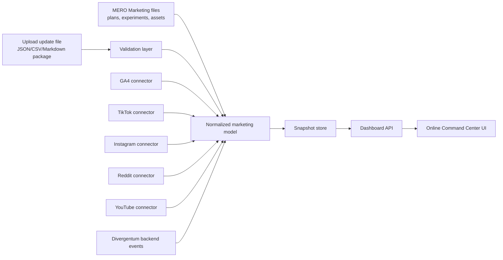

# MERO Marketing Command Center — online architecture

## Purpose

MERO Marketing Command Center is the online control room for marketing work across Merowingus Studio
products. The first product is Divergentum, but the system must be reusable for future products.

The command center should show:

- current marketing focus;
- active channels;
- published assets;
- running experiments;
- planned work;
- manual and automated metrics;
- next actions;
- parked work that must not distract the current launch.

The long-term goal is not a pretty report. The goal is an operating system for marketing decisions.

## Product principle

One dashboard, many data sources.

The UI should not care whether a metric came from a hand-uploaded update file, GA4, TikTok, Instagram,
Reddit, YouTube, or a future internal product event stream. Every source must be normalized into the
same internal data model.

## Phased rollout

### Phase 0 — local MVP

Status: exists in `C:\CODE\MERO MARKETING\dashboard\`.

- Static HTML dashboard.
- Data lives in `dashboard/data.js`.
- Metrics are manual or pending.
- Uses Merowingus Studio design tokens and data-viz language.
- Runs locally through `dashboard/server.js`.

This phase proves the layout, the data vocabulary, and the decision workflow.

### Phase 1 — online static command center with upload updates

Target: publish under the Merowingus Studio website, most likely:

`merowingus.com/tools/marketing`

or behind a private route:

`merowingus.com/internal/marketing`

Core capability:

- The dashboard is online.
- Mykola can upload an update file.
- The app validates the file.
- Valid updates are stored as snapshots.
- The visible dashboard updates from the latest accepted snapshot.

No live platform integrations are required in this phase.

### Phase 2 — authenticated online dashboard

Add authentication and private editing:

- Mykola-only access first.
- Optional public read-only progress page later.
- Upload history.
- Rollback to previous snapshot.
- Basic audit log: who uploaded what and when.

### Phase 3 — direct analytics connectors

Replace or supplement manual update files with direct data sources:

- Google Analytics 4 for website traffic, UTM, signups, activation, purchase.
- TikTok for video and profile metrics where account/API access allows it.
- Instagram / Reels through Meta APIs where account type and permissions allow it.
- Reddit through OAuth/API or approved manual export.
- YouTube through YouTube Data / Analytics APIs.
- Divergentum backend telemetry for `turn_taken`, character creation, session depth, purchases,
  and returning players.

Manual upload remains as a fallback even after connectors exist.

## Recommended architecture



## Application layers

### 1. UI layer

Responsibilities:

- Render campaign state.
- Render channel cards.
- Render data-viz cards and charts.
- Show upload button.
- Show validation results.
- Show latest snapshot timestamp.
- Show next actions and parked work.

Design requirements:

- Use Merowingus Studio design system.
- Use MERO Marketing theme accent.
- Use Studio data-viz tokens from `website/Design/tokens/charts.css`.
- Keep the interface practical and internal-tool-like, not a marketing landing page.

### 2. Upload layer

Responsibilities:

- Accept update files.
- Parse the file.
- Validate schema version.
- Reject unknown or malformed fields.
- Show a human-readable validation report.
- Store valid snapshots.

Accepted v1 format should be JSON.

Reason: JSON maps cleanly to the current `dashboard/data.js` model and can later be generated by
agents, scripts, or connectors.

Example:

```json
{
  "schemaVersion": "mero.marketing.snapshot.v1",
  "generatedAt": "2026-06-29T12:00:00-04:00",
  "product": "Divergentum",
  "campaign": "divergentum_launch_june_2026",
  "channels": [],
  "experiments": [],
  "assets": [],
  "metrics": [],
  "nextActions": []
}
```

### 3. Normalization layer

Responsibilities:

- Convert all data sources into the same internal shape.
- Keep source-specific quirks out of the UI.
- Attach provenance to every metric.

Every metric should carry:

- `source`
- `sourceAccount`
- `channel`
- `campaign`
- `assetId`
- `metricName`
- `value`
- `unit`
- `periodStart`
- `periodEnd`
- `collectedAt`
- `confidence`

Example:

```json
{
  "source": "manual_upload",
  "channel": "tiktok",
  "campaign": "divergentum_launch_june_2026",
  "assetId": "tiktok_wizard_horde_2026_06_27",
  "metricName": "views",
  "value": 0,
  "unit": "count",
  "periodStart": "2026-06-27",
  "periodEnd": "2026-06-28",
  "collectedAt": "2026-06-29T12:00:00-04:00",
  "confidence": "manual"
}
```

### 4. Storage layer

Minimum viable storage:

- snapshots;
- normalized metrics;
- campaign definitions;
- asset registry;
- experiment log;
- upload history.

Recommended tables or collections:

- `campaigns`
- `channels`
- `assets`
- `experiments`
- `metrics`
- `snapshots`
- `uploads`
- `actions`
- `connector_accounts`
- `connector_runs`

### 5. Connector layer

Each connector should be isolated.

Connector responsibilities:

- authenticate;
- fetch raw metrics;
- map raw metrics to normalized metrics;
- store raw response when useful for debugging;
- report rate limits and permission problems;
- never block the whole dashboard if one connector fails.

Initial connectors to design:

1. `ga4`
2. `divergentum_backend`
3. `tiktok`
4. `instagram`
5. `reddit`
6. `youtube`

Exact API permissions and endpoints must be verified at implementation time because social platform
APIs change often.

## Update file strategy

The upload file is not a temporary hack. It is the contract.

Agents, scripts, manual exports, and future connectors should all be able to produce the same
snapshot shape. That means manual work today becomes compatible with automation tomorrow.

### Upload file types

V1:

- JSON snapshot only.

V2:

- CSV metric import.
- Markdown campaign update.
- ZIP package with assets + JSON manifest.

### Validation rules

The upload must reject:

- missing `schemaVersion`;
- unknown product;
- unknown channel;
- metrics without period;
- metrics without source;
- numeric fields that are not numbers;
- duplicated asset ids inside the same snapshot.

The upload may warn but accept:

- missing optional notes;
- missing social platform metrics;
- pending values;
- parked channels.

## Data model

### Product

```json
{
  "id": "divergentum",
  "name": "Divergentum",
  "website": "https://www.divergentum.com/"
}
```

### Campaign

```json
{
  "id": "divergentum_launch_june_2026",
  "productId": "divergentum",
  "status": "running",
  "focus": "Reddit foundation + TikTok first batch",
  "startDate": "2026-06-24"
}
```

### Channel

```json
{
  "id": "tiktok",
  "name": "TikTok",
  "status": "running",
  "role": "Visual proof + fast reach",
  "primaryMetric": "profile visits → signups"
}
```

### Asset

```json
{
  "id": "tiktok_wizard_horde_2026_06_27",
  "channel": "tiktok",
  "type": "video",
  "title": "Wizard: horde arrives",
  "publishedAt": "2026-06-27",
  "url": "",
  "utmContent": "wizard_horde"
}
```

### Experiment

```json
{
  "id": "tiktok_first_launch_batch",
  "channel": "tiktok",
  "hypothesis": "Short visual proof can introduce Divergentum faster than text.",
  "metric": "views, comments, profile visits, website clicks, signups",
  "status": "running",
  "verdict": ""
}
```

### Metric

```json
{
  "assetId": "tiktok_wizard_horde_2026_06_27",
  "metricName": "comments",
  "value": 0,
  "unit": "count",
  "source": "manual_upload",
  "periodStart": "2026-06-27",
  "periodEnd": "2026-06-28"
}
```

## GA4 setup required for the online dashboard

Events:

- `sign_up`
- `login`
- `purchase`
- `turn_taken`
- `session_5_turns`
- `campaign_started`
- `character_created`

Key events:

- `sign_up`
- `session_5_turns`
- `purchase`

UTM convention:

- `utm_source=tiktok|reddit|blog|discord|youtube|instagram`
- `utm_medium=social|community|owned|video`
- `utm_campaign=divergentum_launch_june_2026`
- `utm_content=<asset_slug>`

The dashboard should separate:

- traffic;
- signup;
- activation;
- return;
- purchase.

## Security and access

Phase 1 can be private by obscurity only if it is local or temporary.

For online use:

- require authentication;
- store API tokens server-side only;
- never expose social or analytics tokens in frontend JavaScript;
- encrypt connector credentials;
- keep upload history;
- allow rollback to a previous snapshot.

## Recommended implementation path

1. Keep improving the local dashboard until the data model feels stable.
2. Create `snapshot.v1.json` export/import format.
3. Add local upload preview in the static dashboard.
4. Move dashboard UI into the Studio website.
5. Add a small backend endpoint for upload + validation.
6. Store accepted snapshots.
7. Add GA4 connector first.
8. Add Divergentum backend telemetry second.
9. Add social connectors one by one.

## Open questions for the next architecture pass

- Should the online dashboard be Mykola-only or have a public read-only progress page?
- Which hosting path should own auth: Studio website, separate app, or a small serverless admin route?
- Where should snapshot storage live first: file storage, SQLite, Postgres, Supabase, or another existing Studio backend?
- Which source is first after upload files: GA4 or Divergentum backend telemetry?
- Should Claude Code own implementation in `C:\CODE\MEROWINGUS Studio` while Codex owns the model and marketing content in `C:\CODE\MERO MARKETING`?
